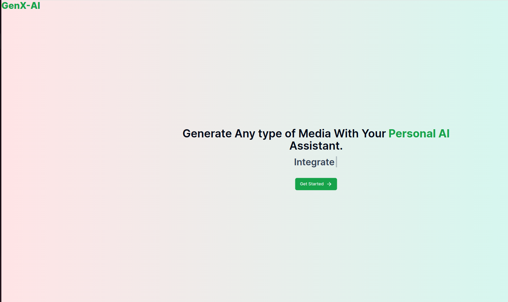
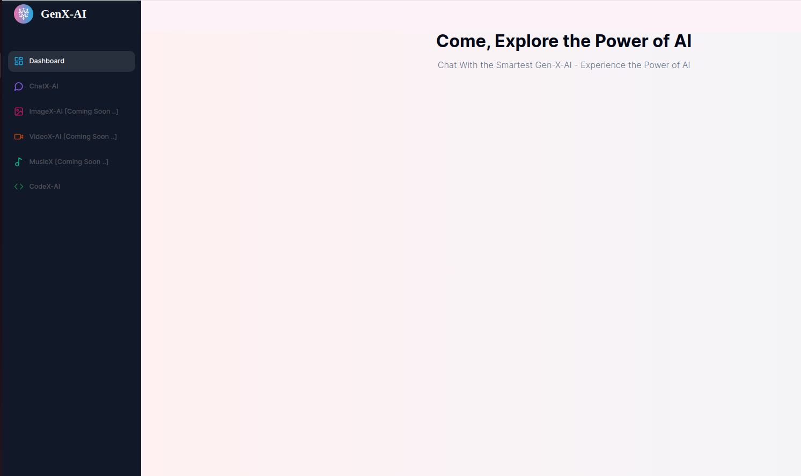
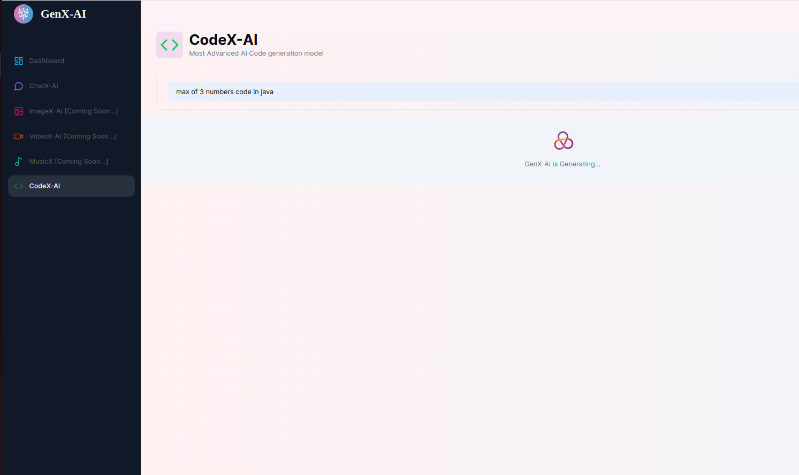
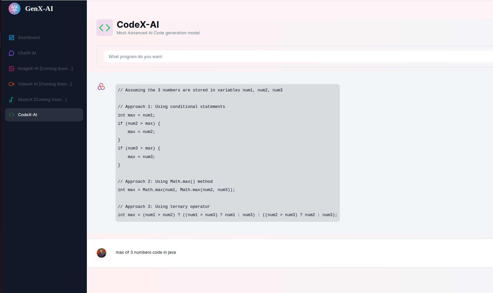

# GenX-AI

An AI Media Generation Platform , that generates Diffrent kinds of Media such as Image,Code, Music,Video and Chat using AI. Get the best customized generated Media from our AI.


### Features

- Image Generation
- Music Generation
- Video Generation
- Code  Generation
- Chat  Generation
- Authentication


### Tech Stack

- TypeScript
- NextJs
- ReactJs
- MySQL
- Prisma ORM
- Tailwind CSS
- OpenAI API
- Replicate AI API 
- Authentication


## Screenshots










### Run Locally

Clone the project

```bash
  git clone https://github.com/neeraj-gs/GenXAI.git
```

Go to the project directory

```bash
  cd genx-ai
```

Install dependencies

```bash
  npm install
```

Add the envirnment varaibles
```bash
NEXT_PUBLIC_CLERK_PUBLISHABLE_KEY
CLERK_SECRET_KEY=
OPENAI_API_KEY=
REPLICATE_API_KEY
```

Start the server

```bash
  npm run dev
```

Project is Installed Locally


### Deployment

The Project is deployed at:

```bash
  https://genx-ai.vercel.app/
```

